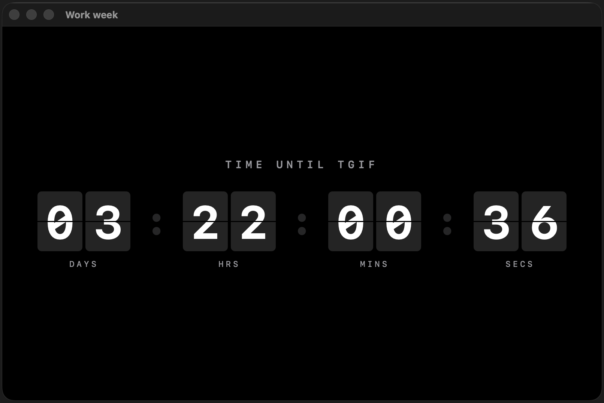

# Flip Clock Screensaver



A macOS screensaver that counts down to the weekend — or back to Monday.

- **Work week mode** — counts days, hours, minutes, seconds until your configured end-of-work time on Friday ("TIME UNTIL TGIF")
- **Weekend mode** — counts days, hours, minutes, seconds until Monday 00:00 ("WEEKEND ENDS IN")

The display is a retro flip clock: each digit sits on a dark card that folds over when it changes, just like a mechanical airport departures board.

**Works in any timezone** — the clock always counts down to your local Friday evening, wherever you are.

**Configurable end-of-work time** — not everyone finishes at 18:00. Open the screensaver options in System Settings to set your own TGIF cutoff.

---

## Quick install (no Xcode required)

A pre-built `.saver` bundle is included in this repo. You don't need to install Xcode or compile anything.

1. [Download the repo as a ZIP](https://github.com/JasmineIsHere/tgif-screensaver/archive/refs/heads/main.zip) — click that link or use the green **Code → Download ZIP** button on GitHub.
2. Unzip the file. You'll get a folder called `tgif-screensaver-main`.
3. Open that folder and find **`FlipClockScreensaver.saver`**.
4. Double-click it — macOS will ask whether to install it for your user only or for everyone. Either option works.
5. Open **System Settings → Screen Saver**, select **Flip Clock Screensaver**, and click **Preview**.

> **Apple Silicon only.** This build targets arm64 (M1/M2/M3/M4 Macs). If you have an Intel Mac, you'll need to build from source (see below).

---

## Requirements

- macOS Ventura (13) or later
- Apple Silicon (arm64)

> To build from source, you also need Xcode 15 or later.

---

## Project structure

```
TheWorkCountdown/
├── FlipClockScreensaver/          Xcode project
│   └── FlipClockScreensaver/
│       ├── CountdownEngine.swift      Pure logic — no UI, no timers
│       ├── FlipDigitView.swift        Single flip card with 3D animation
│       ├── DigitGroupView.swift       Two-card group (tens + units) + label
│       ├── ClockView.swift            Root SwiftUI view, owns the timer
│       └── FlipClockScreensaverView.swift  ScreenSaver.framework bridge
├── Sources/CountdownLogic/        Copy of CountdownEngine for swift test
├── Tests/CountdownLogicTests/     Unit tests for countdown logic
└── Package.swift                  Swift Package (tests only)
```

---

## Configuration

Click **Options...** next to the screensaver in System Settings → Screen Saver to set your end-of-work time. The default is 18:00. Your preference is saved automatically and survives reboots.

---

## Build and install

1. Open `FlipClockScreensaver/FlipClockScreensaver.xcodeproj` in Xcode.
2. Press **⌘B** to build.
3. In the menu bar: **Product → Show Build Folder in Finder**.
4. Navigate to `Products/` and find `FlipClockScreensaver.saver`.
5. Double-click it — macOS will prompt you to install it.
6. Open **System Settings → Screen Saver**, select "Flip Clock Screensaver", click **Preview**.

---

## Run the unit tests

The countdown logic has no UI dependencies, so it can be tested from the terminal:

```bash
DEVELOPER_DIR=/Applications/Xcode.app/Contents/Developer xcrun swift test
```

Tests cover phase detection (work week vs. weekend), days-remaining calculations, and edge cases like Friday at exactly 18:00.

---

## How it works

### Countdown logic (`CountdownEngine.swift`)

A pure static function takes the current `Date` and returns a `TimeRemaining` struct (days / hours / minutes / seconds + which phase). No state, no timers — the same input always produces the same output, which makes it easy to test.

### Flip animation (`FlipDigitView.swift`)

Each digit is rendered with four layers stacked in a `ZStack`:

1. **Top back** — the new digit's top half, always visible behind the flap
2. **Bottom back** — the old digit's bottom half, always visible behind the flap
3. **Top flap** — old digit's top half, rotates from 0° → -90° (folds away)
4. **Bottom flap** — new digit's bottom half, rotates from 90° → 0° (folds in)

The two flaps animate sequentially (each 0.15 s) so the total flip takes 0.30 s.

### ScreenSaver bridge (`FlipClockScreensaverView.swift`)

ScreenSaver.framework is AppKit-based, so the bundle's principal class (`FlipClockScreensaverView`) subclasses `ScreenSaverView` and embeds `ClockView` inside an `NSHostingView`. All SwiftUI logic lives entirely in `ClockView` and below.
